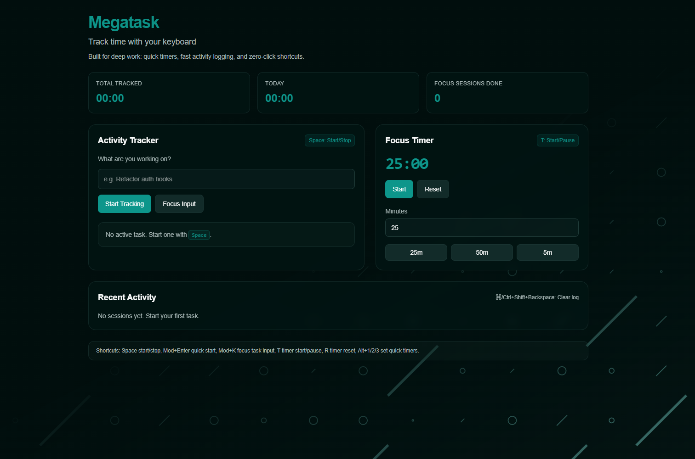

# MegaTask - Activity Tracker & Focus Timer

A modern desktop productivity application built with Tauri, React, and TypeScript. Track your activities, manage your time with a Pomodoro-style focus timer, and export your data to PDF.



## Features

### 🎯 Activity Tracking

- Start/stop tracking time spent on different activities
- Real-time duration tracking
- View all sessions with detailed time logs
- See total tracked time and today's progress
- Persistent data storage (survives app restarts)

### ⏱️ Focus Timer

- Pomodoro-style countdown timer
- Quick timer presets (25 min, 50 min, 5 min)
- Custom timer duration
- Visual progress indicator
- Audio notification when timer completes
- Track completed focus sessions

### 📊 Statistics

- Total time tracked across all sessions
- Today's tracked time
- Number of completed focus sessions
- Recent activity list with timestamps

### 📄 Data Export

- Export your activity data to PDF
- Includes all sessions with timestamps and durations
- Summary statistics

### ⌨️ Keyboard Shortcuts

| Shortcut                       | Action                                |
| ------------------------------ | ------------------------------------- |
| `Space`                        | Toggle activity tracking (play/pause) |
| `Cmd/Ctrl + Enter`             | Start new tracking session            |
| `Cmd/Ctrl + K`                 | Focus activity input field            |
| `T`                            | Toggle focus timer                    |
| `R`                            | Reset/apply custom timer              |
| `Alt + 1`                      | Quick 25-minute timer                 |
| `Alt + 2`                      | Quick 50-minute timer                 |
| `Alt + 3`                      | Quick 5-minute timer                  |
| `Cmd/Ctrl + Shift + Backspace` | Clear all sessions                    |

## Tech Stack

- **Tauri 2** - Desktop application framework
- **React 19** - UI library
- **TypeScript** - Type-safe development
- **Vite** - Fast build tool
- **Tailwind CSS** - Styling
- **@react-pdf/renderer** - PDF export functionality
- **Lucide React** - Icon library

## Getting Started

### Prerequisites

- Node.js (v18 or higher)
- Rust (latest stable version)
- Platform-specific dependencies for Tauri (see [Tauri Prerequisites](https://tauri.app/v2/guides/prerequisites))

### Installation

```bash
# Install dependencies
npm install

# Run in development mode
npm run desktop

# Build for production
npm run build
```

### Available Scripts

- `npm run dev` - Start Vite development server
- `npm run desktop` - Start Tauri desktop app in development mode
- `npm run build` - Build for production
- `npm run preview` - Preview production build

## Project Structure

```
src/
├── components/     # React components
├── hooks/          # Custom React hooks
├── types/          # TypeScript type definitions
├── utils/          # Utility functions
└── App.tsx         # Main application component
```

## Recommended IDE Setup

- [VS Code](https://code.visualstudio.com/) + [Tauri](https://marketplace.visualstudio.com/items?itemName=tauri-apps.tauri-vscode) + [rust-analyzer](https://marketplace.visualstudio.com/items?itemName=rust-lang.rust-analyzer)
